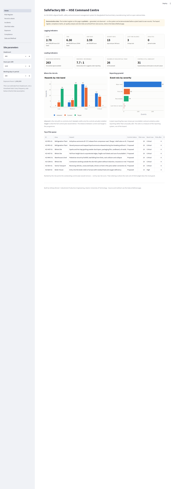
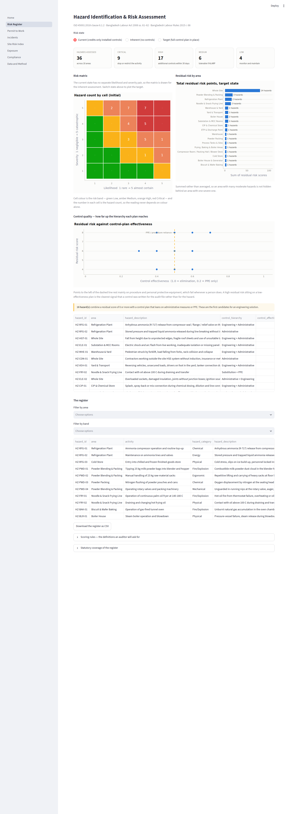
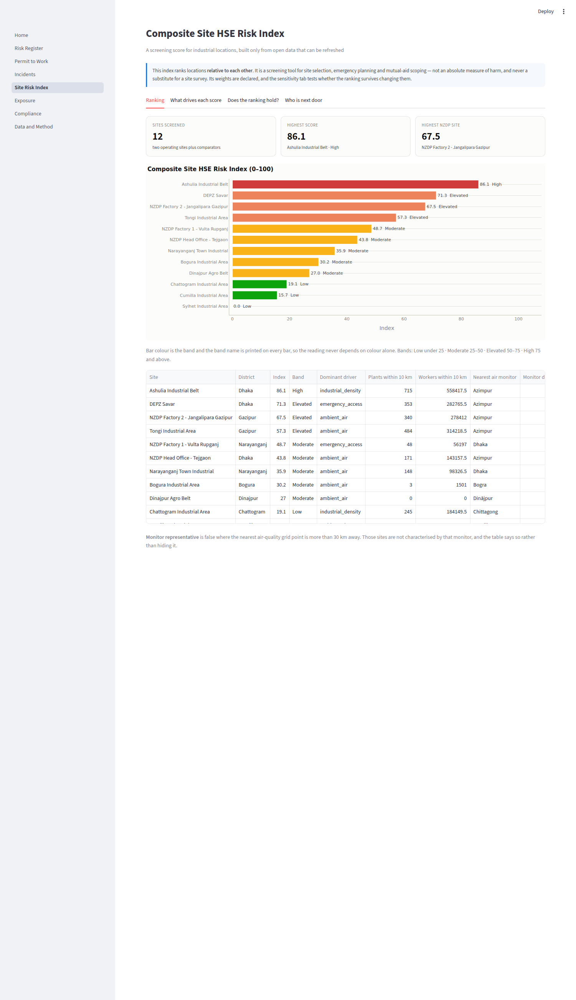
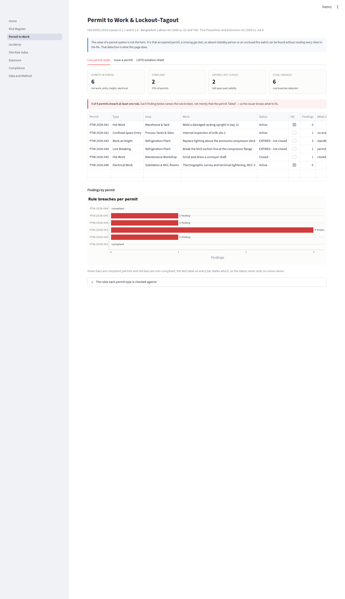
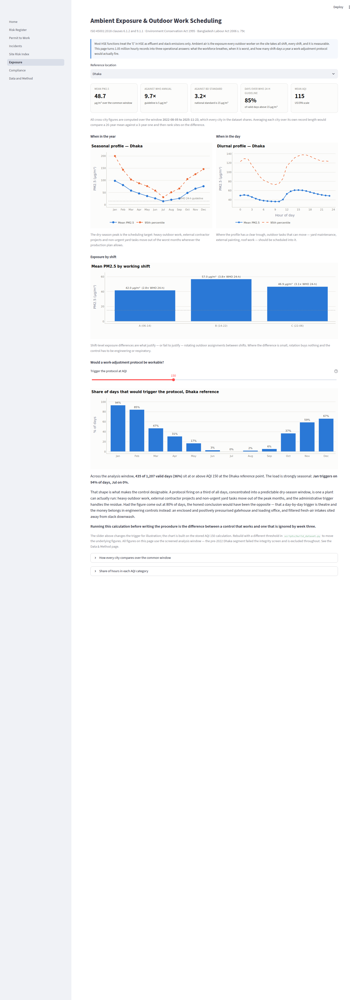

# SafeFactory BD

**ISO 45001-aligned HSE management system for Bangladeshi manufacturing — HIRA, permit to work, LOTO, incident metrics and a compliance matrix mapped to the Labour Act, with a worked dairy and snack-plant register**
[]()
[]()
[](LICENSE)

Most factory HSE work in Bangladesh is done on paper. Most HSE analytics stop at a
chart. This project is the join between the two: a working management system —
hazard register, permit to work, lockout–tagout, incident metrics, compliance
matrix — with a data layer built on 1.05 million hourly air-quality records and
2,123 geocoded industrial facilities, every clause mapped to the Bangladeshi
statute that makes it a legal duty.



---

## What it does

| Module | What it produces | Standard / statute |
|---|---|---|
| **HIRA / JSA engine** | 36-hazard dairy and snack-plant risk register scored on a 5×5 matrix, with a fatality-escalation rule, hierarchy-of-controls scoring, and a three-state view: inherent → current → target | ISO 45001 cl. 6.1.2 · BLA 2006 ss. 61–62 · BLR 2015 r. 68 |
| **Permit to Work** | Seven permit classes, each with validity, gas-test, standby and fire-watch rules; automatic detection of expired, self-issued and unclosed permits | ISO 45001 cl. 8.1.2, 8.1.4 · BLA 2006 s. 62 · Fire Prevention and Extinction Act 2003 ss. 4 & 8 |
| **Lockout–Tagout** | Equipment-specific isolation sheets across eight energy types, refusing sign-off on an electrical-only isolation | ISO 45001 cl. 8.1.2 · BLA 2006 s. 62 |
| **Incident system** | Statutory classification, LTIFR / TRIR / DART / severity rate on their correct bases, Pareto, reporting-health check, 5-Why with a blame detector, bow-tie with gap detection | ISO 45001 cl. 9.1.1, 10.2 · BLA 2006 s. 80 · BLR 2015 r. 73 |
| **Compliance matrix** | 35 requirements mapping every ISO 45001 clause group to its Bangladeshi instrument, with named evidence, verification method, frequency and weighted conformity scoring | ISO 45001 cl. 4–10 · BLA 2006 · BLR 2015 · BNBC 2020 · ECA 1995 |
| **Composite Site HSE Risk Index** | A 0–100 screening score for industrial locations from ambient air burden, industrial density, worker concentration and emergency access — with weight and radius sensitivity analysis | Site selection, emergency planning, mutual-aid scoping |
| **Exposure analytics** | Seasonal, diurnal and by-shift ambient exposure; how many shift-days a year an outdoor-work protocol would actually fire | ISO 45001 cl. 6.1.2, 9.1.1 · BLA 2006 s. 79c |
| **Data integrity screen** | Automatic detection of duplicate city series and synthetic back-fill in the source dataset, blocking any trend claim that fails the screen | — |

---

## Quick start

```bash
git clone https://github.com/<ishtiaqahmed21-hub>/safefactory-bd.git
cd safefactory-bd

pip install -r requirements.txt
python scripts/build_dataset.py        # ~30 seconds
python scripts/make_demo_incidents.py  # synthetic demo register
streamlit run app/Home.py
```

Run the tests:

```bash
python -m pytest tests/ -v
```

**Step-by-step instructions, including Windows and troubleshooting:
[`RUNNING.md`](RUNNING.md).**

### Getting the data

Two raw files are needed in `data/raw/`. They are not committed — the air-quality
file alone is about 22 MB.

| File | What it is | Where it comes from |
|---|---|---|
| `bd_air_quality_hourly.csv.gz` | 1,048,551 hourly records: PM2.5, PM10, CO, NO₂, SO₂, O₃, AQI across 30 named city points, 2000–2025 | Bangladesh AQI dataset, Mendeley Data, DOI [10.17632/9j447cynb9.2](https://data.mendeley.com/datasets/9j447cynb9/2) |
| `osh_facilities_bd.csv` | 2,123 geocoded Bangladeshi apparel and textile facilities with reported worker counts | [Open Supply Hub](https://opensupplyhub.org/), Bangladesh export |

`data/reference/data_sources_manifest.csv` carries the full manifest of
Bangladeshi HSE data sources this project can pull from, including the ones not
yet wired in (SRS annual reports, FSCD statistics, DIFE LIMS, ILOSTAT, RSC
factory database).

---

## Repository layout

```
safefactory-bd/
├── src/safefactory/
│   ├── config.py        every threshold and constant, declared in one place
│   ├── risk.py          5×5 HIRA engine, hierarchy of controls, register analytics
│   ├── ptw.py           permit rules, gas-test acceptance, LOTO isolation logic
│   ├── incidents.py     classification, LTIFR/TRIR/DART/severity, 5-Why, bow-tie
│   ├── compliance.py    ISO 45001 × Bangladesh matrix, weighted conformity scoring
│   ├── exposure.py      ambient exposure analytics and work-adjustment calendars
│   ├── siteindex.py     Composite Site HSE Risk Index and its sensitivity analysis
│   └── quality.py       integrity screening of the source dataset
├── data/
│   ├── raw/             fetched, not committed
│   ├── reference/       the committed inputs — HIRA seed, compliance matrix,
│   │                    national statistics with sources, site coordinates
│   └── processed/       37 tables, rebuilt by scripts/build_dataset.py
├── app/                 Streamlit dashboard, eight pages
├── scripts/             build_dataset.py, make_demo_incidents.py, make_onepager.py
├── tests/               87 unit tests
└── reports/             TECHNICAL_REPORT.md, one-page PDF summary
```

---

## Three things worth looking at first

### 1. The register distinguishes what you have from what you plan

Most risk registers score a hazard twice: inherent, and residual after controls.
The residual score silently assumes every control listed is in place. It usually
is not, and the register becomes a description of an intention rather than of a
plant.

This register carries a `control_status` per hazard and computes a third score.
Controls marked *Proposed* earn no credit at all; *In progress* earns half.

| State | Low | Medium | High | Critical |
|---|---|---|---|---|
| Inherent (no controls) | 0 | 4 | 20 | 12 |
| **Current (what is installed)** | **4** | **6** | **17** | **9** |
| Target (full plan in place) | 16 | 20 | 0 | 0 |

The 26 hazards sitting at High or Critical *today* are the honest number. The
implementation roadmap ranks the outstanding work by the risk points each control
would remove, which is a different — and more useful — order than raw risk score.

### 2. The pipeline refuses to publish a finding it cannot support

The source air-quality dataset contains a 26-year Dhaka record. Fitting a trend
through it returns **+2.55 µg/m³ per year** — a striking, publishable-looking
result.

It is wrong. The 2000–2021 segment rises monotonically *every single year*
(monotone fraction 1.00, linear R² 0.994), then steps down by 68 µg/m³ into a
segment whose coefficient of variation is 0.03. Real ambient particulate records
carry strong, irregular year-to-year variation from monsoon timing and
meteorology. A near-perfect ramp is the signature of interpolated or modelled
back-fill, and a trend fitted through it measures the interpolation.

`quality.py` now detects this automatically, and the build **rejects the trend**:

```
segment 2000-2021 (22 yr): monotone=1.0, R2=0.994, screened=True, synthetic=True
segment 2022-2022 (1 yr):  screened=False
segment 2023-2025 (3 yr):  screened=False
REJECTED: no segment both passes the screen and is long enough.
          No long-run trend will be reported from this dataset.
```

The screen also found that **3 pairs of the 30 named cities carry byte-identical
hourly series** — the file is a gridded product, and city points in the same model
cell share one series. One pair is 3.1 km apart; two are over 30 km apart. Only
27 series are independent.

Both defects would have silently corrupted every downstream figure, and neither is
visible in a summary statistic. Both are covered by unit tests — including one
that confirms screening the *whole* series would miss the defect, which is why the
screen segments first.

### 3. The exposure analysis ends in a control, not a chart

At the Dhaka reference point, **435 of 1,207 valid days (36%)** sit at or above
AQI 150 — and the load is sharply seasonal: January triggers on most days, July on
almost none.

That shape is what makes the control designable. A protocol firing on a third of
days, concentrated in a predictable dry-season window, is one a plant can actually
run. Had the figure come out at 80%, the honest conclusion would have been the
opposite: that a day-by-day administrative trigger is theatre, and the money
belongs in engineering controls instead.

Running the calculation *before* writing the procedure is the difference between a
control that works and one that is ignored by week three.

---

## Screenshots

| | |
|---|---|
|  |  |
| **Risk register** — 5×5 matrix, area profile, control-quality scatter | **Site index** — ranking, drivers, sensitivity, neighbour profile |
|  |  |
| **Permit to Work** — live audit, issue-and-validate, LOTO sheet | **Exposure** — seasonal, diurnal and shift profiles |

---

## What this is not

Stated plainly, because an HSE professional who cannot say where their own numbers
stop being trustworthy is a liability.

- **The incident data is synthetic.** Generated, seeded, reproducible, and labelled
  as such in the filename, in a column of the file itself, and on every page that
  displays it. It exists so the dashboard has something to show before a plant
  loads real records.
- **The risk assessment has not been validated on site.** It is built from the
  company's published description of its operations plus the standard hazard
  profile of dairy and snack-food processing. It is a credible starting register
  and a demonstration of method — not a site assessment. A real HIRA needs a
  walk-through with the people who do the work.
- **Site coordinates are geocoded to sub-district level, not surveyed.** Adequate
  to screen a neighbourhood at 10 km. Not adequate for a dispersion model or an
  evacuation plan.
- **The air-quality data is a gridded model product, not station measurements.**
  Fit for comparing relative ambient burden and characterising exposure shape. Not
  a substitute for a monitor at the site boundary, and no regulatory compliance
  claim should rest on it.
- **The facility registry is sector-skewed** toward apparel and textiles, so
  industrial density is a lower bound and works better in the RMG belt than
  elsewhere.
- **The emergency-access component is a proxy.** It measures distance to an urban
  centre; it does not know where fire stations are. Substituting the FSCD station
  list is the single highest-value improvement available.
- **Compliance scoring is a self-assessment tool.** It structures and weights a
  judgement. It does not replace a third-party audit and confers no certification.

The full limitations section is in [`reports/TECHNICAL_REPORT.md`](reports/TECHNICAL_REPORT.md)
and on the dashboard's Data & Method page.

---

## Documents

- [`reports/TECHNICAL_REPORT.md`](reports/TECHNICAL_REPORT.md) — full method, results and limitations
- [`reports/SafeFactory_BD_One_Page_Summary.pdf`](reports/SafeFactory_BD_One_Page_Summary.pdf) — one-page summary, regenerated from the built data by `scripts/make_onepager.py`
- [`RUNNING.md`](RUNNING.md) — setup and troubleshooting

---

## Sources

National statistics used for benchmarking are in
`data/reference/national_hse_statistics.csv`, each row carrying its source
organisation and URL. The principal ones:

- Safety and Rights Society — [802 workplace deaths in 713 accidents, 2025](https://safetyandrights.org/); [758 deaths in 639 accidents, 2024](https://safetyandrights.org/758-workers-killed-in-workplace-accidents-across-bangladesh-in-2024/)
- OSHE Foundation — [1,190 workplace deaths, 2025](https://www.healthandsafetyinternational.com/article/1944101/workplace-death-toll-hits-1190-bangladesh-2025-report-finds), 84% in the informal sector
- Fire Service and Civil Defence — [27,059 fire incidents in 2025](https://www.tbsnews.net/bangladesh/over-27000-fires-2025-75-day-average-fire-service-report-1357271); electrical short circuit the largest single cause at 34.71%
- DIFE — [Managing Health and Safety in the Workplace](https://dife.portal.gov.bd/sites/default/files/files/dife.portal.gov.bd/publications/00084045_2bb2_4159_861b_1cc488c45881/5%20Managing%20Health%20and%20Safety%20in%20the%20work%20place_%20English%20V9.pdf); [Safety Committee](https://dife.portal.gov.bd/sites/default/files/files/dife.portal.gov.bd/publications/006ad2dc_dd7b_46e3_a865_671a1d508b1e/4%20Safty%20Community_English%20V8.pdf)
- CPD / FES — [Industrial Safety in the RMG Sector in the Post-Accord-Alliance Era](https://bangladesh.fes.de/fileadmin/user_upload/Industrial-Safety-in-the-RMG-Sector-in-the-Post-Accord-Alliance-Era.pdf)
- Bangladesh Bureau of Statistics — Labour Force Survey 2022 and Quarterly LFS 2015-16, 2023

Occupational exposure limits (ammonia PEL/REL/STEL/IDLH, oxygen entry range, noise
action level) and the WHO and Bangladesh ambient standards are listed with their
sources on the dashboard's Data & Method page and in `src/safefactory/config.py`.

---

## Author

**Ishtiaq Ahmed** — Industrial and Production Engineering, Islamic University of
Technology.

Built as an applied HSE engineering project. Contributions, corrections and
challenges to the index weights are welcome — open an issue.

Licensed under the [MIT License](LICENSE).
